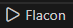
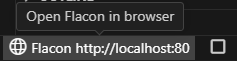
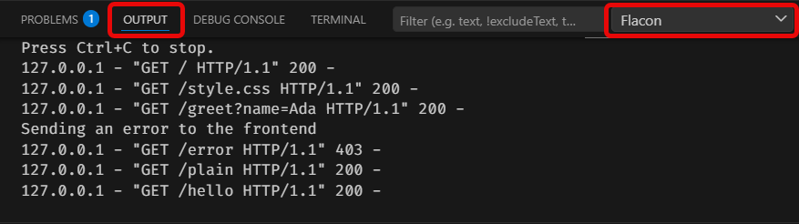

# Flacon in a Box

Flacon in a Box is a small VS Code extension for running the currently opened
folder as a Flask-inspired Python teaching web application.

The extension bundles `resources/flacon_server.py` and starts it with the selected
Python interpreter from the Microsoft Python extension when available.

Once you have set up the basic project layout described below, you can start
the Flacon server by clicking the `Flacon` button.



Once the server has started, the button shows the URL and port number where
your project is available. Clicking this entry opens the URL in your default
browser. Use the stop button to shut down the Flacon server again.



You can check the output of the Flacon server in the VS Code `Output` panel by
selecting the `Flacon` output channel. This is also where you will see output
from `print()` calls in your `backend.py` file.



## Project Layout

For Flacon to serve your application, your project should use this basic
directory layout:

```text
my_project/
  static/
    index.html
    style.css
  backend.py
```

The `static` folder contains static resources such as HTML files, stylesheets,
frontend JavaScript files, and images. Any directory structure inside `static`
is mapped to request URLs. For example, a request to
`http://localhost/images/myimage.png` will be looked up as
`static/images/myimage.png`.

The backend code goes into a file called `backend.py` in the root directory of
your project. If this file is missing, Flacon acts as a simple static resource
web server.

## Commands

The following commands are available from the VS Code Command Palette.

| Command | Explanation |
| --- | --- |
| `Flacon: Setup Initial Project Structure` | Creates a starter `static/` folder, `static/index.html`, and `backend.py`. Existing files are not overwritten. |
| `Flacon: Start` | Starts the Flacon server for the currently opened folder. |
| `Flacon: Stop` | Stops the running Flacon server. |
| `Flacon: Start/Stop` | Starts Flacon if it is stopped, or stops it if it is already running. |
| `Flacon: Open in Browser` | Opens the running Flacon server in your default browser. |
| `Flacon: Fix Pylance warning for 'flacon'` | Adds the bundled Flacon helper file to Pylance so imports such as `from flacon import route` are recognized. |

## Backend Example

```python
from flacon import route

@route("/hello")
def hello():
    return "<h1>Hello from Python</h1>"

@route("/contact")
def contact(request):
    if request.method == "GET":
        return """
        <form action="/contact" method="post">
          <input name="name">
          <button type="submit">Send</button>
        </form>
        """

    name = request.form.get("name", "friend")
    return f"<h1>Hello, {name}!</h1>"
```

## Backend API

Backend routes are written in `backend.py`. Import the Flacon helpers you want
to use at the top of the file:

```python
from flacon import html_page, json, route, text
```

### Routes

Use `@route("/some/path")` directly above a function to connect that URL path to
the function.

```python
@route("/hello")
def hello():
    return html_page("<h1>Hello!</h1>")
```

The route function may have no parameters:

```python
@route("/hello")
def hello():
    return "Hello!"
```

Or it may have one parameter, usually called `request`:

```python
@route("/greet")
def greet(request):
    name = request.query.get("name", "World")
    return html_page(f"<h1>Hello, {name}!</h1>")
```

A route function must return one of these values:

| Return value | Meaning |
| --- | --- |
| `str` | Sent as an HTML response. |
| `bytes` | Sent as raw response data. |
| `Response` | Sent with the status code, content type, and headers from that response. The helper functions below create `Response` values for you. |
| `None` | Sends an empty response. |

If a route function raises an error, Flacon sends a `500 Internal Server Error`
page to the browser. The error message and any `print()` output are visible in
the `Flacon` output channel in VS Code.

### Request

If a route function has one parameter, Flacon passes a `request` value to it.
This contains information about the current browser request.

| Name | Type | Explanation |
| --- | --- | --- |
| `request.path` | `str` | The requested URL path, for example `"/hello"`. |
| `request.method` | `str` | The HTTP method, usually `"GET"` or `"POST"`. |
| `request.query` | `dict[str, str]` | Query string values from the URL. If a name occurs more than once, this contains the last value. |
| `request.query_all` | `dict[str, list[str]]` | Query string values from the URL, keeping all values for repeated names. |
| `request.form` | `dict[str, str]` | Submitted form values for `POST` requests with normal HTML forms. If a name occurs more than once, this contains the last value. |
| `request.form_all` | `dict[str, list[str]]` | Submitted form values, keeping all values for repeated names. |
| `request.body` | `str` | The raw request body as text. |
| `request.headers` | object | The request headers sent by the browser. |

### Helper Functions

`html_page(body, status=200)` returns an HTML response.

```python
return html_page("<h1>Hello!</h1>")
```

`text(body, status=200)` returns a plain-text response.

```python
return text("Hello!")
```

`json(data, status=200)` returns a JSON response. Pass it a JSON string.

```python
return json('{"message": "Hello!"}')
```

All three helper functions accept an optional status code:

```python
return html_page("<h1>Forbidden</h1>", 403)
```

Any output created with `print()` will be visible in the `Flacon` output channel
in VS Code.

## Development

The canonical Python runtime is `resources/flacon_server.py`. During
`npm run compile`, it is copied to `resources/pylance/flacon.py` so Pylance can
resolve `from flacon import ...` in student projects. `vsce package` also runs
this compile step through `vscode:prepublish`.

Install dependencies:

```powershell
npm install
```

Compile:

```powershell
npm run compile
```

Run the extension from VS Code with the `Run Extension` launch configuration.
